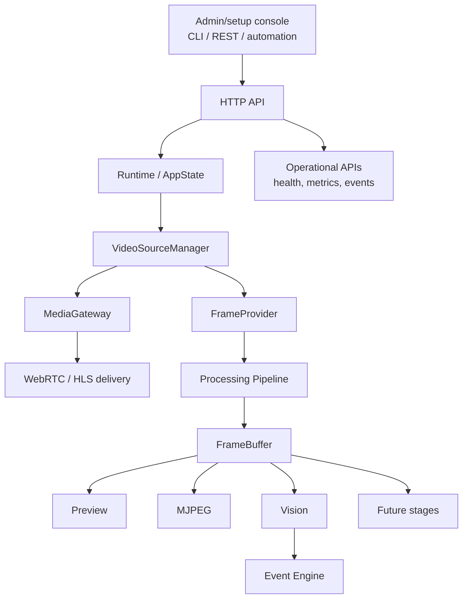

# Architecture

## Purpose and scope

Sentinel Streaming is a standalone and embeddable video streaming platform. It
discovers, connects, controls, monitors, and delivers IP camera streams through
web-friendly APIs and its own setup/operations console. Product policy,
notifications, alarms, identity management, and domain workflows remain outside
this repository.

## System flow

The Sentinel Streaming web console is a first-party administration surface for
setup, diagnostics, and operations. Sentinel Home, Sentinel Campus, and Sentinel
Buildings remain separate domain applications and consume the stable API; they
are not merged into this runtime or its console.

## Zero-friction onboarding boundary

Camera onboarding is an orchestration workflow over existing source, ONVIF,
health, recovery, and media boundaries. The normal path should discover local
devices, let an operator select one, request credentials only when needed,
negotiate a usable profile, verify connectivity and browser playback, show a
preview, and save a friendly name/location. Manual RTSP URLs and protocol-level
configuration belong under an explicit Advanced path.

The setup verifier should return normalized checks such as connectivity, ONVIF,
video profile, RTSP, browser playback, audio, PTZ, AI readiness, and health
monitoring. It must distinguish `supported`, `unsupported`, `not configured`,
`failed`, and `not checked`; it must not expose ONVIF/media-server internals as
an onboarding requirement.

The `HealthMonitor` and `RecoveryEngine` observe these runtime boundaries and
coordinate corrective actions without bypassing source, pipeline, or buffer
ownership rules.

Every captured frame enters through `FrameProvider` and is processed by the
pipeline. Higher-level consumers read from the `FrameBuffer`; they do not
communicate directly with camera implementations.

## Runtime lifecycle

The `serve` command owns the process lifecycle:

1. Initialize structured logging.
2. Load default/runtime configuration.
3. Create the shutdown channel and central `AppState`.
4. Create the bounded frame buffer.
5. Start the built-in source through `VideoSourceManager`.
6. Initialize the processing pipeline.
7. Start optional Vision scheduling.
8. Start the HTTP server.
9. Wait for Ctrl+C, an API shutdown request, or a subsystem failure.
10. Signal all tasks and camera workers to stop.
11. Wait for HTTP, pipeline, and vision tasks to exit.

The shutdown API and Ctrl+C use the same watch channel, keeping shutdown paths
consistent.

## Core boundaries

### Video source boundary

`VideoSourceManager` is the only owner of source registration and lifecycle.
Built-in camera, synthetic, image-sequence, video-file, RTSP, and MJPEG adapters
are functional. USB/UVC uses the built-in camera provider. ONVIF discovery and
capability normalization are handled by the ONVIF boundary; PTZ remains
capability-gated. Every adapter
emits `Frame` values through the same manager-owned `FrameProvider`, so pipeline,
buffer, MJPEG, Vision, and event consumers do not branch on source type.

The macOS Nokhwa camera backend is not `Send`. It is therefore constructed and
used on a dedicated `sentinel-camera` OS thread. Frames cross into the async
runtime through a bounded Tokio channel.

Camera failure transitions to `Disconnected` and then `Reconnecting`. Reconnect
attempts use configurable bounded exponential backoff with optional jitter and
continue until the source reconnects, is explicitly stopped, or the service
shuts down.

### Pipeline boundary

The pipeline receives frames from `FrameProvider` and runs configured stages.
Preview is the current working stage. Buffer, recording, vision, and event
stages are represented as extension points; Vision currently also runs as a
dedicated consumer of the frame buffer.

### Media delivery boundary

`MediaGateway` owns the normalized boundary between validated RTSP sources and
browser playback. `MediaMtxAdapter` is the current optional implementation: it
registers and removes validated sources through the MediaMTX API and returns
normalized WebRTC-first and HLS-fallback playback contracts. MediaMTX is an
external service, not a required Rust child process or a public downstream
configuration contract. Camera/source health and media-delivery health are
tracked separately.

### Frame buffer boundary

`FrameBuffer` is a bounded, thread-safe, timestamp/sequence-ordered store. It
keeps recent frames and evicts the oldest frame at capacity. Its contents are
shared through `Arc`, avoiding copies between preview, MJPEG, and Vision.

### Observation boundary

Vision produces scene observations. The Event Engine stores those observations
and source lifecycle events. Consumers receive facts; they do not receive
security decisions.

## Central application state

`AppState` shares the operational components required by API handlers:

- configuration
- health state
- runtime status
- metrics
- source manager
- event bus/store
- authentication validator
- latest preview
- frame buffer
- latest vision observation
- MJPEG metrics/stream access
- graceful-shutdown sender

## Module map

| Module | Responsibility |
|---|---|
| `main.rs` | CLI dispatch and runtime orchestration |
| `api.rs` | Axum routes, authentication middleware, handlers |
| `cli.rs` | API-backed command-line interface |
| `config.rs` | Runtime defaults and stage configuration |
| `sources.rs` | Source abstractions, camera worker, manager, lifecycle |
| `media.rs` | MediaGateway contract and optional MediaMTX adapter |
| `frame.rs` | Frame representation and RGB payload ownership |
| `frame_buffer.rs` | Bounded shared recent-frame store |
| `pipeline.rs` | Single frame-processing loop |
| `stages.rs` | Preview and placeholder pipeline stages |
| `preview.rs` | Latest JPEG preview storage |
| `mjpeg.rs` | Multipart MJPEG consumers and metrics |
| `vision.rs` | Temporal selection, OpenAI provider, scheduler, metrics |
| `events.rs` | Typed event records, bounded store, SSE broadcast |
| `health.rs` | Liveness/readiness state |
| `metrics.rs` | Core Prometheus-compatible metrics |
| `runtime.rs` | Lifecycle status snapshot |
| `logging.rs` | Structured tracing initialization |

## Design invariants

1. Camera implementations are owned by `VideoSourceManager`.
2. Frames do not bypass `FrameProvider` and the pipeline.
3. Higher-level consumers read from `FrameBuffer`, not cameras.
4. Memory used by frame and event stores is bounded by configuration.
5. Vision unavailability must not prevent video runtime startup.
6. Administration clients use the public API instead of duplicating business logic.
7. Products interpret observations; the streaming service does not make alarms or policy decisions.

## Capability-driven ONVIF control

ONVIF capabilities belong to the existing camera/source model. A future ONVIF
adapter must normalize discovered capabilities rather than introduce a separate
PTZ subsystem or assume that every ONVIF camera is controllable. The normalized
capability tree should retain service availability and supported operations,
including video, audio, events, and PTZ operations such as pan, tilt, zoom,
presets, absolute move, relative move, and continuous move.

PTZ API routes and admin-console controls must be exposed only when the selected
camera/profile reports the corresponding capability. Unsupported operations
must return a clear capability error and must not be sent to the device.

PTZ is consequential device control. It requires operation-level authorization
in addition to the existing bearer authentication, and every attempted command
must use the existing event/logging mechanisms for operational evidence. The
evidence contract should include initiator, camera ID, operation, requested
movement or preset, timestamp, outcome, and request/correlation ID once request
correlation is available.

Testing is explicitly layered: deterministic protocol/unit tests first,
emulator integration tests second, and physical-camera verification separately.
Emulator success must never be reported as physical-device validation.
