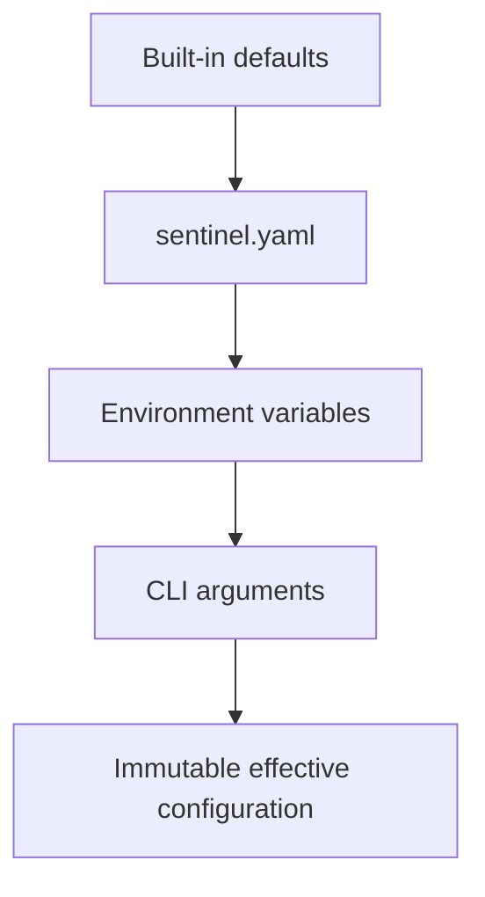

# Configuration Guide

Sentinel Streaming loads one immutable effective configuration at startup. No
database is used and hot reload is not supported.

## Precedence



The default file is `sentinel.yaml` in the process working directory. Override
it with `sentinel-streaming serve --config config/production.yaml`. If the file
does not exist, built-in defaults are used.

## Example

```yaml
server:
  bind: 0.0.0.0:8080

vision:
  provider: openai
  enabled: true
  interval: 5s
  frames: 5
  spacing: 2s

sources:
  - id: synthetic-demo
    name: Synthetic Demo
    type: synthetic
    width: 1280
    height: 720
    fps: 30

  - id: front-gate
    name: Front Gate
    type: rtsp
    uri: rtsp://camera-host/stream
    transport: tcp
    credentials:
      username_env: FRONT_GATE_USERNAME
      password_env: FRONT_GATE_PASSWORD

logging:
  level: info

metrics:
  enabled: true
```

Sources declared in YAML are registered automatically. The current runtime has
one active `FrameProvider` stream, so the first enabled source is started and
additional configured sources remain registered for API lifecycle control.

## Environment overrides

```bash
SENTINEL_BIND=127.0.0.1:8081
SENTINEL_FPS=30
SENTINEL_VISION_ENABLED=false
SENTINEL_VISION_PROVIDER=openai
SENTINEL_VISION_INTERVAL=10s
SENTINEL_BUFFER_CAPACITY=600
```

Operational variables remain supported: `OPENAI_API_KEY`, `SENTINEL_API_TOKEN`,
`SENTINEL_CAMERA_INDEX`, and `SENTINEL_FFMPEG`. RTSP passwords must use
`username_env` and `password_env` references rather than clear text.

## CLI overrides

CLI values have the highest priority:

```bash
sentinel-streaming serve \
  --config config/production.yaml \
  --bind 127.0.0.1:8081 \
  --source synthetic
```

`--source` replaces the configured source list with the requested source type.

## Effective configuration

`sentinel-streaming config show` reads `GET /api/v1/config` from the running
service. The response is read-only and reports effective values. Secret values
are never included; RTSP environment variable names may be shown because they
are references rather than credentials.
