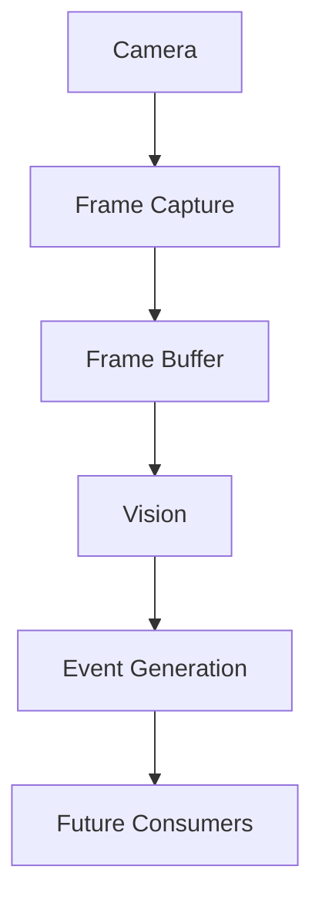

# Observability

Sentinel Streaming is designed to integrate with modern observability systems
through open standards rather than vendor-specific implementations.

## Logging

The service uses structured `tracing` logs. Runtime and subsystem operations are
logged with contextual fields where available, including:

- runtime startup and shutdown
- camera startup, failure, reconnect, and lifecycle changes
- pipeline initialization and processing failures
- Vision provider requests, latency, success, and failure
- event publication
- MJPEG viewer connections, disconnections, and stream errors

The logging layer supports environment-configurable filtering through the
`tracing-subscriber` environment filter. JSON output is enabled by the current
logging subscriber configuration.

Support-bundle requests accept `X-Request-ID` and preserve request and
correlation context in the bundle manifest. Existing consequential operations
also record correlation IDs in operational event metadata. Full propagation to
every pipeline and Vision operation remains later hardening work.

## Metrics

`GET /metrics` exposes Prometheus-compatible text metrics. Current metric groups
include:

- runtime uptime, connected sources, aggregate FPS, dropped frames, and memory field
- registered, active, and failed sources
- frames received per source and reconnect counts in source status
- Vision requests, successes, failures, latency, frame count, and last analysis time
- event store size and event categories
- MJPEG viewers, frames, bytes, errors, and delivery FPS

The following are production-hardening targets and are not yet complete across
all platforms:

- portable process CPU utilization
- portable process memory/RSS measurement
- ring-buffer occupancy, evictions, and utilization ratio
- end-to-end frame age and pipeline latency
- network throughput and per-client bandwidth
- explicit event throughput rates

Metric names should remain stable once exposed to shared dashboards. New labels
must be bounded; camera IDs and event types must not allow unbounded cardinality.

## Tracing

The architecture is intended to support OpenTelemetry distributed tracing across
the pipeline:

OpenTelemetry exporters and remote span propagation are planned. The current
implementation provides structured logs and metrics but does not yet ship an
OpenTelemetry SDK or exporter.

## Support bundle

`GET /api/v1/support/bundle` returns a bounded, sanitized diagnostic snapshot.
The API does not write files or collect arbitrary host data. The CLI exporter
creates the portable bundle layout and can include one operator-selected log
file after redacting lines containing credential or authorization markers.

The bundle contains instance/deployment identity, API/schema and build versions,
runtime/security mode, effective sanitized configuration and hash, source
summary, dependency health, recent operational events, and bounded health and
metrics state. It intentionally excludes camera credentials, bearer tokens,
bootstrap secrets, raw authorization headers, and MediaMTX administration
secrets.

## Platform integration

Open standards allow the service to feed platforms such as:

- Grafana and Prometheus
- Jaeger and Zipkin
- Dynatrace
- Elastic
- Splunk
- Datadog
- Azure Monitor
- New Relic

The service should not contain vendor-specific monitoring code. Platform
integration belongs in deployment configuration, collectors, exporters, or
agents. Adding a supported backend should not require changing camera,
pipeline, Vision, or event logic.

## Observability requirements for production

Every major subsystem should provide:

1. Structured logs for lifecycle and failure transitions.
2. A bounded, meaningful metric set.
3. Health or readiness impact where appropriate.
4. Runtime status visible through the administration API.
5. Event history for source and observation changes.
6. Trace context once OpenTelemetry support is introduced.

Operational dashboards should make it possible to answer:

- Is the process alive and ready?
- Is each source connected and producing frames?
- Are frames being dropped or aging in the buffer?
- Are viewers receiving frames at the expected rate?
- Is Vision succeeding, failing, or falling behind?
- Are events being generated and retained?
- Is CPU, memory, or network usage approaching a limit?
