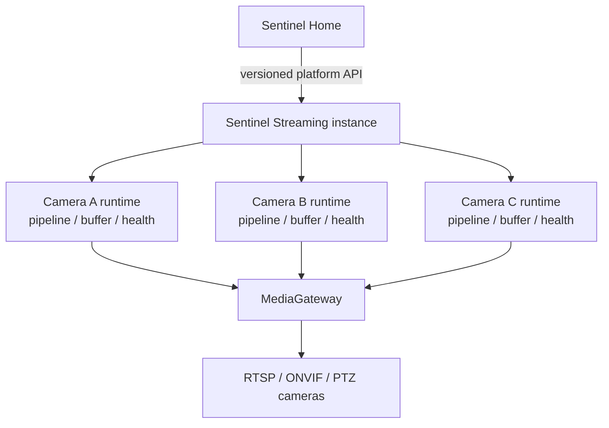

# Sentinel Platform Integration Boundary

## Purpose

Sentinel Streaming is a standalone product and an embeddable edge platform
service. Sentinel Home, Campus, Buildings, and future domain products consume
its versioned contracts without becoming runtime dependencies.

The initial commercial deployment model is one Streaming instance per home or
managed site. Domain products own tenancy.

## Product ownership

Sentinel Streaming owns camera discovery and credentials, ONVIF/RTSP/PTZ,
source lifecycle, media delivery, health and recovery, camera diagnostics,
bounded capture, and optional factual observations.

Sentinel Home owns households, users, rooms, arming modes, alarm and incident
policy, notifications, escalation, and domain timelines.

The governing rule is:

> Sentinel Streaming publishes facts; domain products make domain decisions.

Domain products never call cameras or MediaMTX directly. Streaming never imports
domain product models or reads their databases.

## Administration console

Sentinel Streaming retains its own setup and operations console. Standalone
deployments expose it to authorized operators. Embedded deployments may place it
on a management network, disable it by policy, or launch it from another product.
Camera discovery, onboarding, protocol negotiation, PTZ testing, playback
verification, and diagnostics remain Streaming responsibilities implemented
through the public Streaming API.

## Source-scoped target runtime

The current implementation still has one active decoded processing path. It
must not be represented as a concurrent multi-camera runtime until SS-WP-015B
implements ADR 0008.

## Pre-Home integration gate

Sentinel Home must not take a production dependency on Streaming until all of
the following are available and contract-tested:

- stable Streaming instance and immutable camera identities;
- concurrent per-source runtime isolation;
- externally asserted identity through a replaceable authentication seam;
- source- and artifact-scoped authorization;
- versioned API, error, event, and artifact-reference contracts;
- secure, expiring playback delegation;
- compatibility and independent upgrade/rollback rules.

Home development can proceed independently or against versioned mock contracts
while this gate remains open.

## Virtual Camera Lab boundary

The lab interacts with Streaming only through camera-facing RTSP, RTP, ONVIF,
and PTZ protocols. Engineers and CI use a separate lab control plane for camera
definitions, scenarios, fault injection, ground truth, and evidence export.

Production products never depend on the lab control API. In end-to-end tests,
ground truth evaluates what Streaming and Home observed; it is not an input to
their production decision paths.
