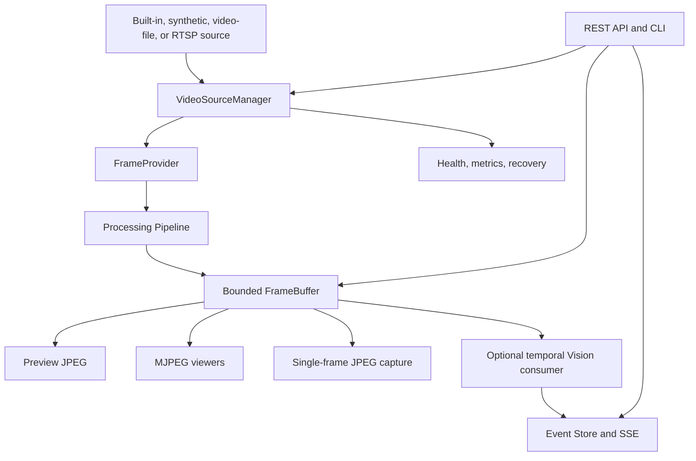

# Sentinel Streaming Technical Design

## Runtime topology



## Source implementations

`VideoSourceManager` is the only owner of source lifecycle. The functional
source adapters are:

- `BuiltInCamera`: native camera capture through Nokhwa.
- `SyntheticSource`: deterministic generated frames.
- `FfmpegVideoFileSource`: real-time MP4/container decoding through FFmpeg,
  with optional looping.
- `RtspVideoSource`: RTSP/TCP decoding through FFmpeg.

All adapters emit the same RGB `Frame` through a bounded worker channel. The
pipeline has no camera-specific branches.

## Frame capture API

`GET /api/v1/streams/{sourceId}/frame` returns one JPEG encoded from the latest
buffered RGB frame. It is intentionally bounded to one image and is the
contract consumed by Sentinel Home for operator-triggered AI analysis. It does
not expose the camera implementation or a raw video stream.

Current limitation: the decoded runtime has one active source and one global
frame buffer. The route validates `sourceId` but does not yet select a distinct
source-scoped buffer. Sentinel Home must not treat this endpoint as a concurrent
multi-camera contract until SS-WP-015B implements ADR 0008.

The browser stream uses:

```text
GET /api/v1/streams/{sourceId}/mjpeg
```

The MJPEG consumer and frame capture consumer both read from `FrameBuffer`, so
neither can block or bypass the capture pipeline.

Under ADR 0008 this invariant becomes source-scoped: both consumers read from
the requested camera's bounded buffer.

## Configuration example

```yaml
server:
  bind: 127.0.0.1:8081

sources:
  - id: front-gate
    name: Front Gate Demo
    type: video-file
    path: platform/sentinel-streaming/samples/front-gate.mp4
    loop: true
    width: 640
    height: 360
    fps: 15
```

For RTSP:

```yaml
sources:
  - id: front-gate
    type: rtsp
    uri: rtsp://127.0.0.1:8554/front-gate
    transport: tcp
```

## Failure behavior

Source decode failures transition the source to a disconnected/reconnecting
state and invoke the configured recovery policy. A missing frame returns a
clear `404` from the capture endpoint. A stopped source returns `503`.

The Streaming process can continue serving health and administration endpoints
while a source is unavailable. AI and event consumers are downstream of the
buffer and cannot prevent source recovery or MJPEG delivery.
